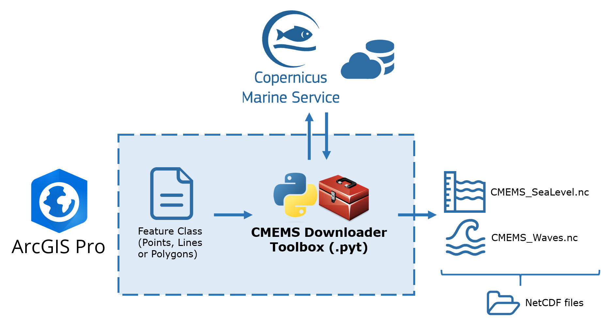
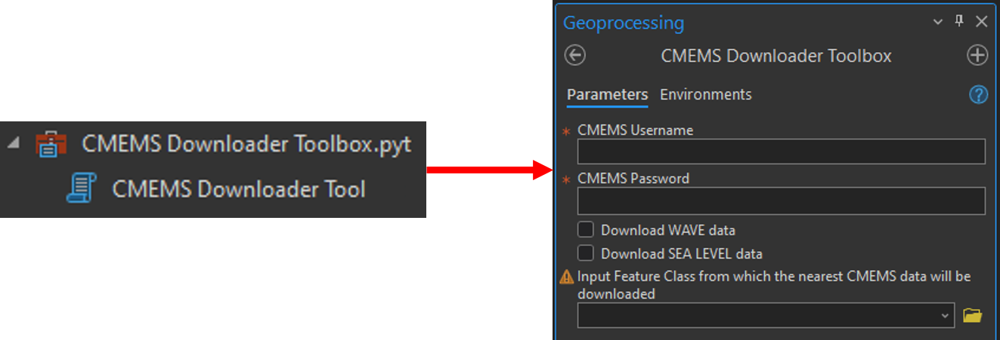

<a name="readme-top"></a>
# CMEMS Downloader Toolbox for ArcGIS Pro 🧰🌎

 The CMEMS Downloader Toolbox is an ArcGIS Python Toolbox that enables automatic retrieval of marine data from the Copernicus Marine Service using a simple Feature Class input.

 <div align="center">
  <a href="https://github.com/AlbertGallegoJimenez/cmems-downloader-toolbox">
    
  </a>
</div>

<!-- FEATURES -->
## Features
- **Download Marine Data**: Download wave data or sea level data from the Copernicus Marine Service based on the location of the input Feature Class.
- **Automatic Data Processing**: Automatically process downloaded marine data, i.e. find the nearest valid node.
- **User-friendly Interface**: Intuitive toolbox interface within ArcGIS Pro.

> [!IMPORTANT]
> **Attention:** This repository is intended exclusively for downloading wave and sea level data for the European Atlantic facade (the Iberia-Biscay-Ireland zone). To customize the tool for other regions, please access the source code and modify the dataset IDs to be downloaded accordingly.

<!-- INSTALLATION -->
## Installation
1. Clone or download this repository to your local machine.
2. Open ArcGIS Pro.
3. Navigate to the ArcGIS Pro "Catalog" pane.
4. Right-click on "Toolboxes" and select "Add Toolbox".
5. Browse to the location where you saved the downloaded toolbox file (*CMEMS Downloader Toolbox.pyt*) and click "OK".

<!-- REQUIREMENTS -->
## Requirements
- ```ArcGIS Pro```
- ```Python 3.x```
- ```xarray```
- ```pyproj```
- ```numpy```
- ```arcpy (ArcGIS Python module)```
- ```copernicus_marine_client```

> [!WARNING]
> Note that you must clone the ArcGIS Pro default environment to install new libraries in the Anaconda environment.

<!-- USAGE -->
## Usage
1. Double-click to open the "CMEMS Downloader Tool" tool.
2. Input your CMEMS username and password.
3. Select the type of data you want to download (Waves, Sea Level).
4. Choose the Feature Class from which the nearest CMEMS data will be downloaded.
5. Click "Run".

<div align="center">
  <a href="https://github.com/AlbertGallegoJimenez/cmems-downloader-toolbox">
    
  </a>
</div>

     
<!-- CONTACT -->
## Contact

Albert Gallego Jiménez - [LinkedIn](https://www.linkedin.com/in/albert-gallego-jimenez) - agalleji8@gmail.com

Project Link: [https://github.com/AlbertGallegoJimenez/cmems-downloader-toolbox](https://github.com/AlbertGallegoJimenez/cmems-downloader-toolbox)

<p align="right">(<a href="#readme-top">back to top</a>)</p>
